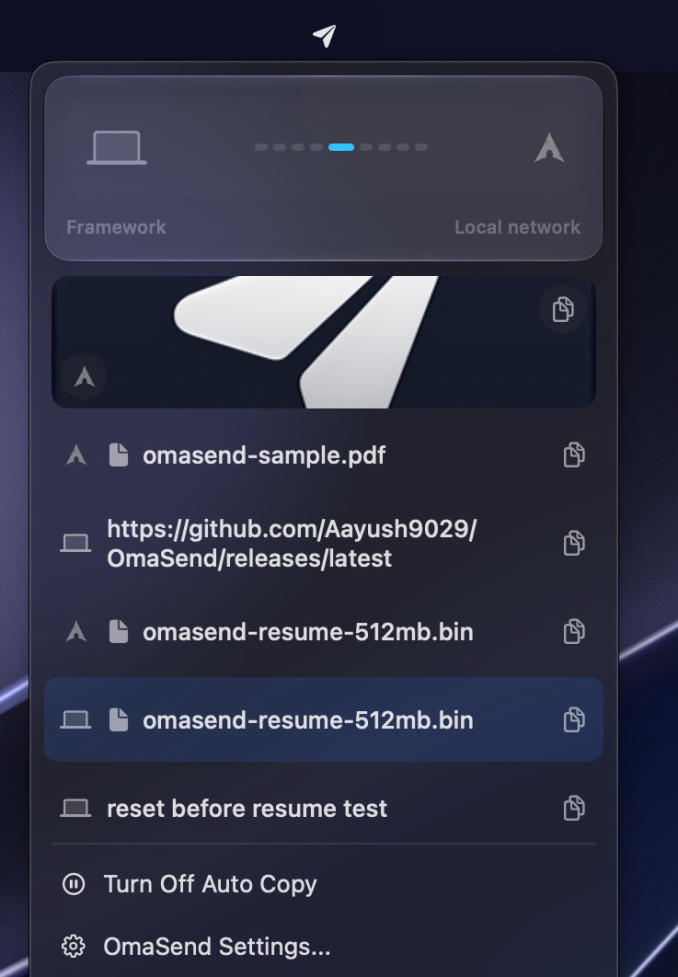
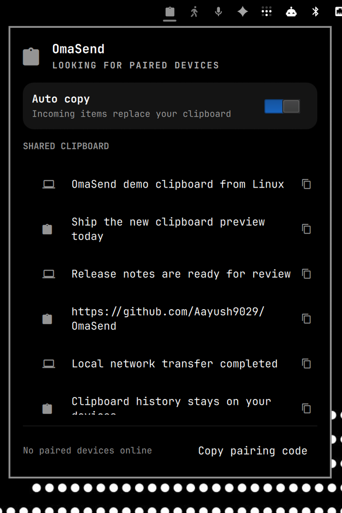

<p align="center">
  
</p>

<h1 align="center">OmaSend</h1>

<p align="center">One clipboard across macOS and Omarchy.</p>

<p align="center">
  
  
</p>

## Install

### [macOS](https://github.com/Aayush9029/OmaSend/releases/latest)

### Linux and Omarchy

```bash
curl -fsSL https://raw.githubusercontent.com/Aayush9029/OmaSend/main/install.sh | bash
```

## Pair

Run `omasend pair show`, then enter the code in **OmaSend Settings > Devices** on your Mac.

Text, images, and files travel directly over your local network or Tailscale with AES-256-GCM encryption. No cloud or account.

[MIT](LICENSE) · [Protocol](PROTOCOL.md)
