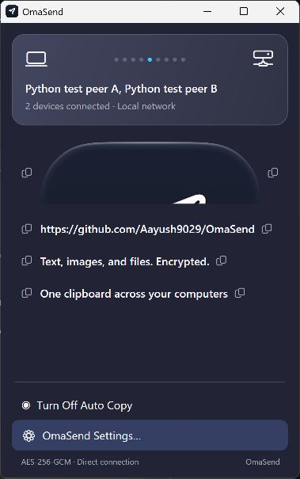
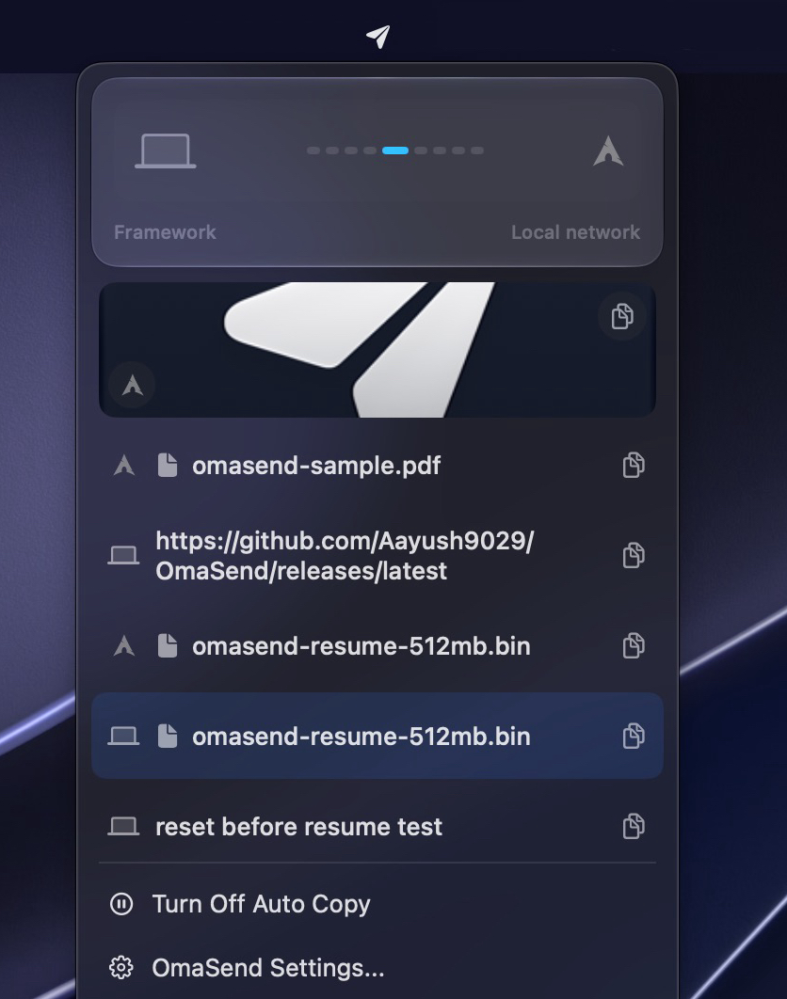
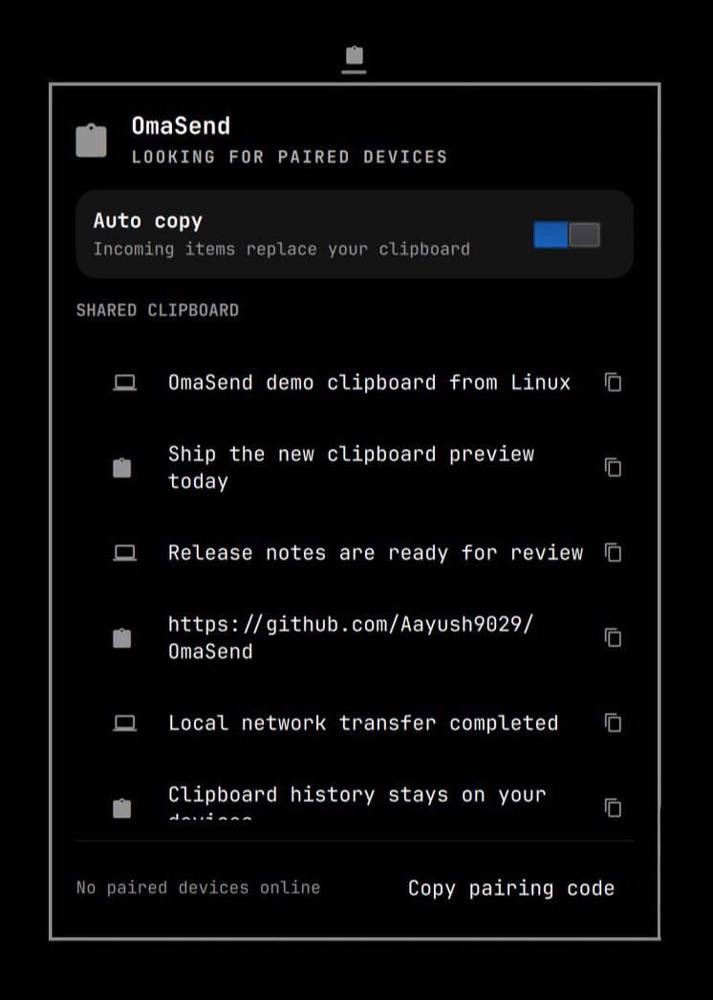

<p align="center">
  
</p>

<h1 align="center">OmaSend</h1>
<p align="center">One shared clipboard across Windows, macOS, Linux, and your browser.</p>

Share text, images, and files directly between your computers. No cloud or account. Includes clipboard history, auto copy, and resumable file transfers.

## Windows



Native Windows 11 tray app. x64 and ARM64 packages include .NET; there is no separate runtime to install.

Install with one line in PowerShell:

```powershell
Invoke-WebRequest https://raw.githubusercontent.com/Aayush9029/OmaSend/main/install.ps1 -OutFile "$env:TEMP\OmaSend-install.ps1"; & "$env:TEMP\OmaSend-install.ps1"
```

The current build is unsigned and can be blocked by Smart App Control. [Windows install details](docs/INSTALL.md#windows-11).

<sub>Windows image rendered from the current native WPF app on a Windows CI runner, using sample history.</sub>

## macOS



Apple Silicon, macOS 15 or later. With [Homebrew](https://brew.sh) installed:

```bash
brew tap aayush9029/omasend https://github.com/Aayush9029/OmaSend && brew install --cask aayush9029/omasend/omasend
```

Or [download the macOS app](https://github.com/Aayush9029/OmaSend/releases/latest). The tap uses this repository and installs the checksum-pinned published release. macOS security checks still apply.

## Linux



Wayland with `wl-clipboard` and systemd user services:

```bash
curl -fsSL https://raw.githubusercontent.com/Aayush9029/OmaSend/main/install.sh | bash
```

The installer also enables the panel on compatible **Omarchy Shell** systems. Other Wayland desktops use the native daemon and CLI: `omasend status`. [Linux install details](docs/INSTALL.md#linux).

## Web companion

Open OmaSend in a browser on your local network. Send text, attach files, copy shared text, and download incoming files. Runs on Windows, macOS and Linux as one executable, with no extra runtime.

Download the [web companion for your OS](https://github.com/Aayush9029/OmaSend/releases/tag/v0.2.0) and run `omasend-web` (`omasend-web.exe` on Windows). No extra runtime is required.

Or build and run from this repository with Go installed:

```sh
cd linux && go run ./cmd/omasend-web
```

Open **http://localhost:53318**. Add `--lan YOUR_LAN_IP` to make it available to other browsers on that network. [Setup, packaged builds and browser limits](docs/WEB.md).

## Pair your devices

Use the same pairing code on every computer: **Settings > Pairing code** on Windows, **OmaSend Settings > Devices** on macOS, or `omasend pair set <code>` on Linux. Enable **Auto copy** to put received items directly on the clipboard.

Prefer no key? Version 0.2.0 has an optional **Trusted LAN** switch in Windows Settings, macOS Devices, the Linux panel (`omasend lan on`), and the web companion. Enable it on each device to share without copying keys. It is unencrypted and disabled by default; older apps need an update to use it.

## Security

By default, clipboard data and files travel directly between paired devices using AES-256-GCM. Optional Trusted LAN skips keys and encryption: anyone on that network can read or send items. The browser-to-companion LAN HTTP connection is also unencrypted.

[Protocol](PROTOCOL.md) · [Build and screenshots](docs/DEVELOPMENT.md) · [Test results](docs/VALIDATION.md) · [MIT license](LICENSE)
